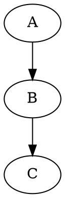

# Pandoc Markdown Guide for This Project

This file documents the conventions and best practices for writing Markdown
content that gets compiled to HTML via Pandoc. Follow these rules when
creating or editing any `.md` file under `content/`.

## YAML Frontmatter

Every page except `index.md` uses a YAML frontmatter block:

```yaml
---
title: My Page Title
keywords: [topic1, topic2]
date: 2026-05-12
theme: math
description: A short description for metadata.
---
```

| Field             | Required | Notes                                               |
|-------------------|----------|------------------------------------------------------|
| `title`           | yes      | Page title                                           |
| `keywords`        | no       | List or single string for metadata                   |
| `date`            | no       | YYYY-MM-DD. Auto-formatted by `date.lua` filter      |
| `theme`           | no       | CSS theme class (math, nlp, time-series, etc.)       |
| `description`     | no       | Meta description. If omitted, not set.                |
| `post`            | no       | Set `post: true` to mark as a post (adds to listing)  |
| `suppress-bibliography` | no | Set `true` to hide the bibliography section          |
| `thumbnail`       | no       | Thumbnail image filename for post cards              |

## Math / LaTeX (KaTeX)

The site uses **KaTeX** (configured in `pandoc.yaml`).

### Inline math

Use single `$` delimiters:

```markdown
The variable $X_t$ follows a normal distribution.
```

### Display math

Use double `$$` delimiters for centered equations:

```markdown
$$
f(x) = \frac{1}{\sigma \sqrt{2\pi}} e^{-\frac{1}{2}\left(\frac{x-\mu}{\sigma}\right)^2}
$$
```

### Aligned / multi-line equations

Use `\begin{aligned}` inside `$$`:

```markdown
$$
\begin{aligned}
\gamma_0 &= \text{Var}(x_t) = \sigma^2 \\
\gamma_1 &= \text{Cov}(x_t, x_{t-1}) = -\theta \sigma^2
\end{aligned}
$$
```

### Rules

- **NEVER** put formulas inside fenced code blocks (backticks). Pandoc will
  treat them as literal code, not math, and KaTeX will not render them.
- Use built-in LaTeX macros: `\sum`, `\prod`, `\infty`, `\alpha`, `\beta`,
  `\theta`, `\phi`, `\varepsilon`, `\rho`, `\sigma`, `\mu`, `\omega`,
  `\ldots`, `\cdots`, `\text{}`, `\operatorname{}`, `\max`, `\min`, `\log`,
  `\exp`, `\implies`, `\iff`, `\to`, `\mapsto`, `\partial`, `\nabla`,
  `\begin{cases}`, `\begin{pmatrix}`, `\begin{align*}`, etc.
- Wrap matrices inside `$$` with `\begin{pmatrix}`.

## Lists

### Unordered lists

Put a **blank line** between items when items span multiple lines or contain
block content:

```markdown
- First item with a long description that wraps
  to the next line. Keep the continuation indented.

- Second item.
```

### Ordered lists

Same rule: blank line between multi-line items:

```markdown
1. Compute the mean:
   $$
   \bar{x} = \frac{1}{n}\sum x_i
   $$

2. Compute the variance:
   $$
   \sigma^2 = \frac{1}{n}\sum (x_i - \bar{x})^2
   $$
```

### Nested lists

Indent the sub-list by 4 spaces. Blank line before the sub-list:

```markdown
- Category A

    - Sub-item 1
    - Sub-item 2

- Category B
```

### Rule of thumb

If any item contains more than one line (paragraph, code block, math block,
table), put a blank line between ALL items in that list — not just the
multi-line ones. Consistency prevents Pandoc parsing errors.

## Links

### External links

Standard Markdown:

```markdown
[visible text](https://example.com)
```

### Internal links

Use the full site URL (the `url.lua` filter will not transform these):

```markdown
[About me](/about/)
[School index](/school/school-post-index/)
```

### Link to PDFs

PDF links get enhanced by `figure.lua` to open in a modal:

```markdown
[Download thesis](/data/mscthesis.pdf)
```

## Images

### Regular images

```markdown

```

### SVG images

SVG images are wrapped in an `<object>` tag by `figure.lua` for better
browser support:

```markdown

```

### PDF embedding

PDF images are rendered as `<iframe>` elements:

```markdown

```

### TikZ figures

Use fenced code blocks with class `tikz` or `tikzcd`. These get compiled to
SVG during build:

~~~markdown
```tikz
\node[draw] (a) {A};
\node[draw, right of=a] (b) {B};
\draw[->] (a) -- (b);
```
~~~

```markdown
```tikz
\node[draw] (a) {A};
\node[draw, right of=a] (b) {B};
\draw[->] (a) -- (b);
```
```

### Graphviz / DOT figures

```markdown

```

## Code Blocks

Use fenced code blocks with a language identifier for syntax highlighting:

~~~markdown
```python
def hello():
    print("Hello, world!")
```
~~~

The `highlight-style: kate` in `pandoc.yaml` controls the color scheme.

## Tables

Pandoc supports pipe tables and multiline tables. Pipe tables are preferred:

```markdown
| Header 1 | Header 2 |
|-----------|----------|
| Cell A1   | Cell B1  |
| Cell A2   | Cell B2  |
```

For tables with complex content (math, lists), consider using raw HTML
instead (see "Raw HTML" below).

## Citations and Bibliography

References are managed in `refs.bib` (BibLaTeX format). The `bib.lua`
filter also supports inline ````bibtex` / ````biblatex` raw blocks.

Cite entries with `@key`:

```markdown
This result was shown in @smith2024.

Some authors argue otherwise [see @jones2023, p. 42].
```

The bibliography is auto-generated at the end of posts. Set
`suppress-bibliography: true` in frontmatter to hide it.

## Heading Levels

For **posts** (files under `content/posts/` and `content/school/`), Pandoc
uses `--shift-heading-level-by=1`. This means:

| Written in `.md` | Rendered in HTML |
|------------------|------------------|
| `# Title`        | `<h2>`           |
| `## Section`     | `<h3>`           |
| `### Subsection` | `<h4>`           |

For **pages** (about, masters, etc.), there is no shifting:

| Written in `.md` | Rendered in HTML |
|------------------|------------------|
| `# Title`        | `<h1>`           |

Plan accordingly: start posts with `#` (which becomes `<h2>`).

## Raw HTML in Markdown

You can embed raw HTML inside ````{=html}` blocks. This is useful for
complex layouts, panels, or elements not expressible in Markdown:

```markdown
```{=html}
<div class="panel">
  <h2 class="section-title">Special Section</h2>
  <p>Custom HTML content here.</p>
</div>
```
```

The site uses native fenced divs (`:::`) for some layouts:

```markdown
::: {.panel id="posts"}
Content here...
:::
```

## Footnotes

```markdown
Here is some text with a footnote.[^1]

[^1]: The footnote content goes here.
```

## Blockquotes

```markdown
> This is a blockquote.
>
> It can span multiple paragraphs.
```

## Special Features

### Post lists

Insert an ordered list of recent posts:

```markdown
{{ post-list 5 }}
```

Replace `5` with how many posts to show. Omit the number to show all:

```markdown
{{ post-list }}
```

### School lists

Same syntax for school posts:

```markdown
{{ school-list 3 }}
```

### Combined recent lists

Shows both posts and school posts:

```markdown
{{ recent-list 7 }}
```

### Date handling

The `date.lua` filter auto-formats dates. If no `date` is set in frontmatter,
today's date is used. Format: `YYYY-MM-DD` in frontmatter.

### URL generation

The `url.lua` filter automatically generates a canonical URL based on the
output file path and `site-url` from `pandoc.yaml`. Do **not** set `url`
manually in frontmatter.

## File Naming

- Use **kebab-case** for filenames: `my-post-title.md`
- Files go in `content/posts/` or `content/school/`
- Each file produces `build/posts/<name>/index.html` or
  `build/school/<name>/index.html`
- Literate Haskell files (`.md.lhs`) are also supported

## Build Process

Run `make` to build everything. The `Makefile` handles:

- Post processing (heading shift, date, bib, figure filters)
- Page processing (post-list, url filters)
- SVG minification
- TikZ → SVG conversion
- RSS feed generation
- Search index generation

## Quick Reference

| Element         | Syntax                                                  |
|-----------------|---------------------------------------------------------|
| Inline math     | `$a^2 + b^2 = c^2$`                                    |
| Display math    | `$$ E = mc^2 $$`                                        |
| Bold            | `**bold**`                                              |
| Italic          | `*italic*`                                              |
| Inline code     | `` `code` ``                                            |
| Code block      | ```` ```python … ``` ````                               |
| Link            | `[text](url)`                                           |
| Image           | ``                                           |
| Footnote        | `[^1]` … `[^1]: text`                                   |
| Citation        | `@key` or `[@key]`                                      |
| Post list       | `{{ post-list N }}`                                     |
| Raw HTML        | ```` ```{=html} … ``` ````                              |
| Fenced div      | `::: {.class}` … `:::`                                  |
| Horizontal rule | `---`                                                   |
